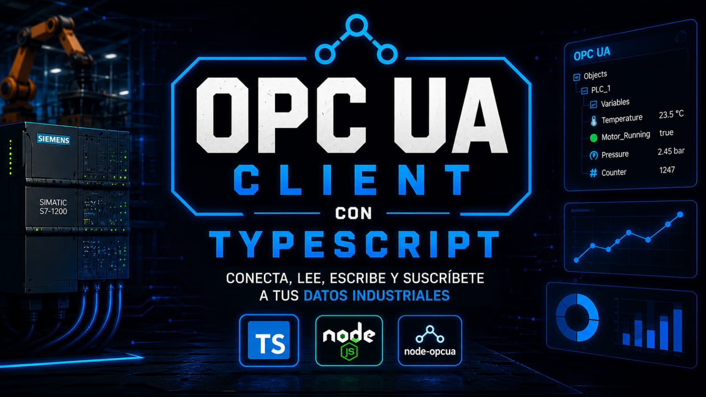

# OPC UA Client con TypeScript

Ejemplo educativo para crear clientes  OPC UA utilizando TypeScript y Node OPCUA. La idea de este proyecto no es únicamente mostrar código funcionando. El objetivo es entender cómo funciona OPC UA internamente mientras interactuamos con un servidor real.



Todos los ejemplos fueron diseñados para ejecutarse contra el proyecto: **opc-server-simulator**


## ¿Qué es OPC UA?

OPC UA (Open Platform Communications Unified Architecture) es un protocolo industrial utilizado para intercambiar información entre dispositivos, PLCs, HMIs, sistemas SCADA, MES, aplicaciones de escritorio, servicios web y plataformas IoT.

A diferencia de protocolos más simples, OPC UA no solamente transmite valores.

OPC UA expone un modelo completo de información.

Por ejemplo, una variable puede contener:

* Nombre
* Descripción
* Tipo de dato
* Valor
* Permisos de acceso
* Timestamps
* Relaciones con otros nodos

---

# Conceptos fundamentales

## NodeId

Cada elemento dentro de un servidor OPC UA posee un identificador único llamado NodeId.

Ejemplos:

```text
ns=1;s=Temperature

ns=1;s=Pressure

ns=1;s=IsRunning
```

Un NodeId está compuesto por:

```text
ns=1;s=Temperature
│    │
│    └── Identificador
│
└────── Namespace
```

---

## Namespace

Los namespaces permiten organizar los nodos dentro de un servidor.

Ejemplo:

```text
ns=0
```

Namespace estándar definido por la OPC Foundation.

```text
ns=1
```

Namespace personalizado de nuestra aplicación.

---

### Namespace 0

Todos los servidores OPC UA contienen un namespace estándar:

```text
ns=0
```

Algunos NodeIds importantes:

```text
ns=0;i=84    RootFolder
ns=0;i=85    ObjectsFolder
ns=0;i=86    TypesFolder
ns=0;i=87    ViewsFolder
```

---

## Identificadores

Un NodeId puede utilizar distintos tipos de identificador.

### String

```text
ns=1;s=Temperature
```

### Numérico

```text
ns=0;i=85
```

### GUID

```text
ns=1;g=550e8400-e29b-41d4-a716-446655440000
```

### ByteString

```text
ns=1;b=...
```

En aplicaciones industriales normalmente veremos identificadores String o Numéricos.

---

# ¿Qué es Browse?

Browse es el proceso de explorar la estructura del servidor.

Es similar a navegar carpetas dentro de un sistema de archivos.

Ejemplo:

```text
Objects
│
└── SimulatedDevice
    ├── Temperature
    ├── Pressure
    ├── IsRunning
    ├── Counter
    ├── Status
    └── LastUpdate
```

Browse permite descubrir:

* NodeIds
* Variables
* Objetos
* Métodos
* Tipos de dato
* Estructura del servidor

Para ejecutar el ejemplo "browse.ts, simplemente realizamos

```cmd
npm run browse
```

# ¿Qué es un NodeClass?

Cada nodo pertenece a una categoría.

Las más comunes son:

```text
Object
Variable
Method
ObjectType
VariableType
DataType
View
```

Ejemplos:

```text
SimulatedDevice -> Object

Temperature -> Variable

ResetMachine -> Method
```

---

# ¿Qué es un Attribute?

En OPC UA prácticamente toda la información se obtiene leyendo atributos.

Por ejemplo:

```text
BrowseName
DisplayName
Description
DataType
AccessLevel
Value
```

Cuando hacemos:

```ts
AttributeIds.Value
```

estamos leyendo únicamente el atributo Value.

El valor es sólo un atributo más del nodo.

---

# ¿Qué es un DataType?

Cada variable tiene asociado un tipo de dato.

En OPC UA los tipos estándar están definidos mediante identificadores numéricos.

Ejemplos:

```text
1   Boolean
6   Int32
10  Float
11  Double
12  String
13  DateTime
```

Cuando realizamos un Browse veremos algo similar a:

```text
Temperature

NodeId:
ns=1;s=Temperature

DataType:
11 (Double)
```

Es importante entender que OPC UA no almacena el texto "Double".

Internamente almacena una referencia al tipo de dato estándar.

El cliente es quien interpreta que:

```text
11 = Double
```

---

# ¿Qué es AccessLevel?

AccessLevel define las operaciones permitidas sobre un nodo.

Valores comunes:

```text
1 = Read

2 = Write

3 = Read + Write
```

Ejemplos:

```text
Temperature

AccessLevel = 1

Read Only
```

```text
IsRunning

AccessLevel = 3

Read / Write
```

---

# AccessLevel vs UserAccessLevel

No siempre son iguales.

AccessLevel indica lo que permite el servidor.

UserAccessLevel indica lo que puede hacer el usuario autenticado.

Ejemplo:

```text
Servidor:

Read + Write
```

```text
Usuario Operador:

Read Only
```

En este caso:

```text
AccessLevel = 3

UserAccessLevel = 1
```

---

# ¿Qué es una Subscription?

Las subscriptions permiten recibir cambios automáticamente.

Sin subscriptions:

```text
Cliente
│
└── Lee cada cierto tiempo
```

Con subscriptions:

```text
Servidor
│
└── Notifica cambios al cliente
```

---

# ¿Qué es un MonitoredItem?

Un MonitoredItem representa un atributo monitoreado.

Jerarquía:

```text
Session
│
└── Subscription
     │
     └── MonitoredItem
          │
          └── Variable
```

Por ejemplo:

```text
Session
│
└── Subscription
     │
     └── Temperature.Value
```

---

# Ejemplos incluidos

## 1. Browse

```bash
npm run browse
```

Explora la estructura del servidor.

Permite descubrir:

* NodeIds
* NodeClass
* DataTypes

Salida esperada:

```text
Temperature

NodeId:
ns=1;s=Temperature

DataType:
11 (Double)
```

---

## 2. Read

```bash
npm run read
```

Lee el valor actual de varias variables.

Salida esperada:

```text
Temperature: 23.4

Pressure: 101.2

IsRunning: true
```

---

## 3. Access Levels

```bash
npm run access
```

Muestra los permisos de cada variable.

Salida esperada:

```text
Temperature

AccessLevel:
1

Read Only
```

```text
IsRunning

AccessLevel:
3

Read / Write
```

---

## 4. Subscribe

```bash
npm run subscribe
```

Crea una Subscription y recibe cambios automáticamente.

Salida esperada:

```text
Temperature:
21.4

Temperature:
22.1

Temperature:
20.8
```

---

## 5. Write

```bash
npm run write
```

Lee el valor actual de una variable, escribe un nuevo valor y verifica el resultado.

Salida esperada:

```text
Valor actual:
false

Nuevo valor:
true

Escritura exitosa

Valor después de escribir:
true
```

Este ejemplo puede observarse simultáneamente desde UA Expert para visualizar el cambio en tiempo real.

---

# Herramientas recomendadas

## UA Expert

Cliente OPC UA gratuito ampliamente utilizado para pruebas y diagnóstico. Para descargarlo simplemente hay que crear un usuario y descargarlo desde: [link](https://www.unified-automation.com/products/development-tools/uaexpert.html)


Permite:

* Navegar nodos
* Leer valores
* Escribir variables
* Crear subscriptions
* Inspeccionar DataTypes
* Revisar AccessLevels

---

# Licencia

MIT
